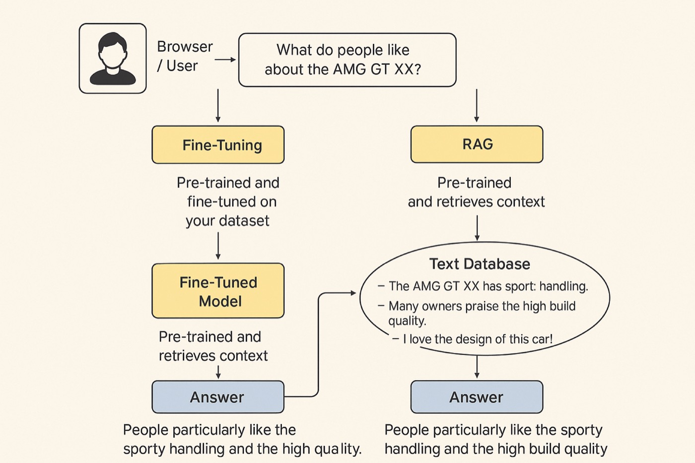
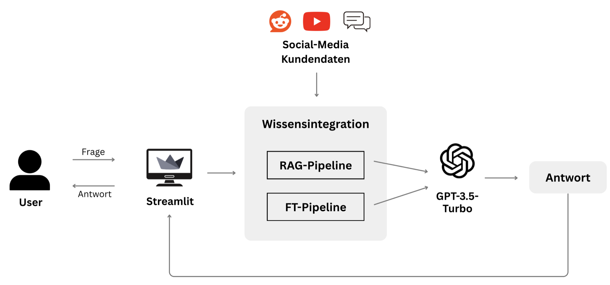
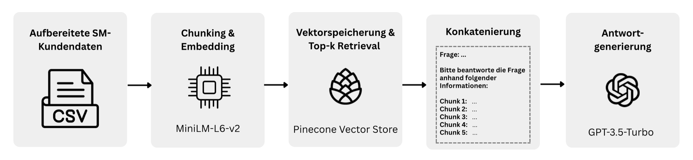
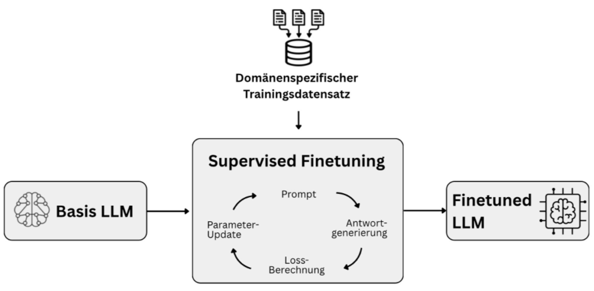
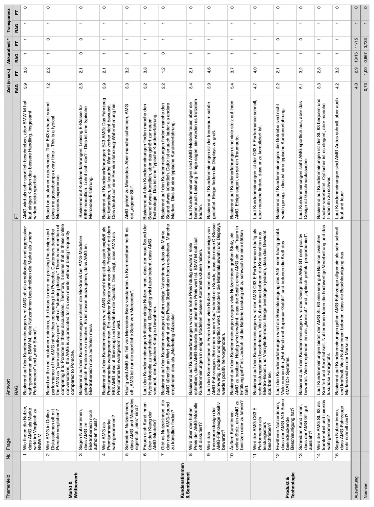
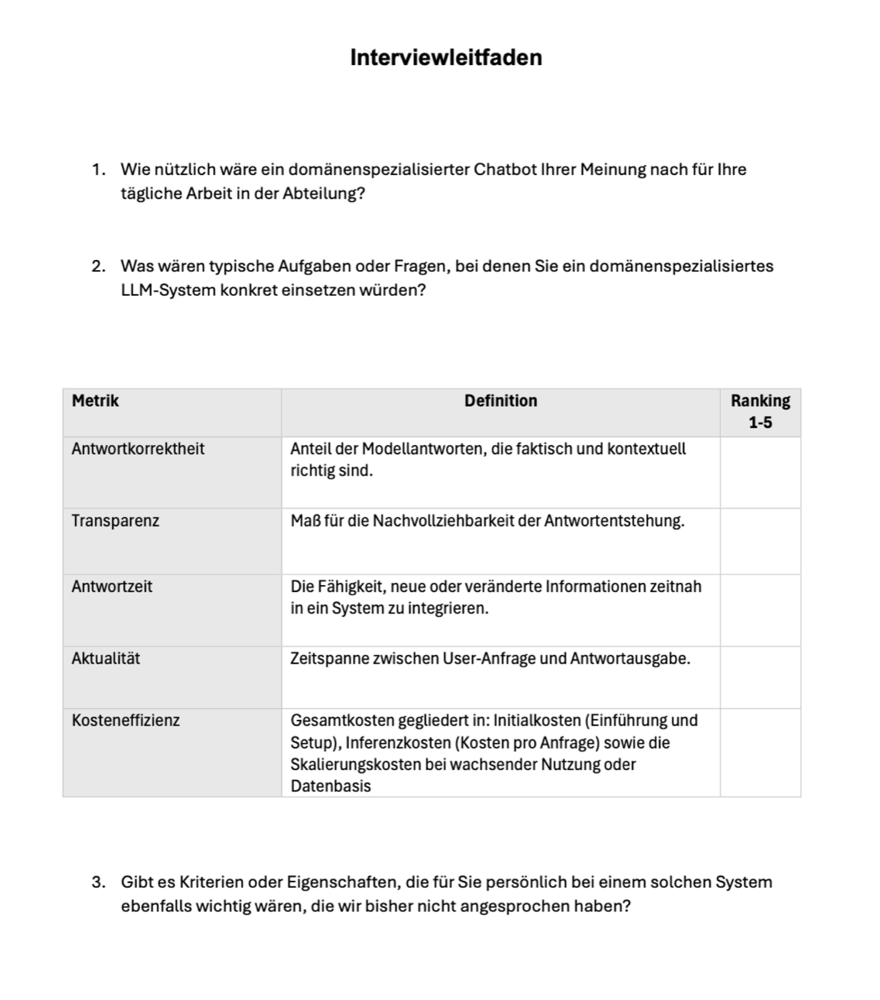
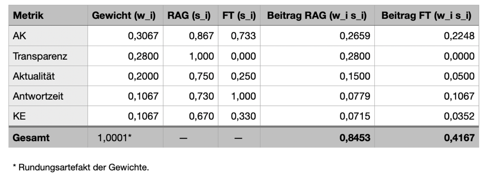

# rag-vs-finetuning-eval

**A stakeholder-weighted utility analysis of RAG versus fine-tuning for domain-specific
question answering, as a tested Python package with the thesis case study built in**

> Project thesis (Projektarbeit 2) by **Cecilia Nothstein**<br>
> DHBW Stuttgart, Business Information Systems<br>
> Written in cooperation with **Mercedes-AMG** @ Portfolio Strategy & Market Intelligence

[](https://github.com/ceciiliaaa/rag-vs-finetuning-eval/actions/workflows/ci.yml)


Generic language models answer domain-specific questions imprecisely; the two established
ways to specialise them are retrieval-augmented generation (RAG) and fine-tuning. Published
comparisons look at technical performance. A department that has to pick one of them also
cares whether it can see where an answer came from, how quickly new customer feedback shows
up in the answers, how long a query takes, and what the system costs over its lifetime. Those
criteria pull in different directions, and different stakeholders weigh them differently.



*Same question, two ways to inject domain knowledge. Fine-tuning changes the model. RAG leaves
the model untouched and retrieves the relevant customer posts into the prompt.*

This repository is the evaluation instrument of a Design Science Research thesis that asked:

> **RQ** Which of the two methods for domain specialisation of large language models,
> retrieval-augmented generation or fine-tuning, achieves the higher economic value in the
> context of analysing social-media customer data?

Economic value is treated as a multi-criteria construct: answer correctness, transparency,
recency, response time and cost efficiency, weighted by the people who would use the system,
and aggregated in a utility analysis (Nutzwertanalyse). Two prototypes were built on the same
corpus and evaluated on the same 15 questions.

The short answer: **RAG reaches a utility of 0.8461 against 0.4171 for fine-tuning**, and the
ranking is not fragile. RAG stays ahead when any single criterion is dropped, wins in 100 % of
10 000 perturbed weight vectors, and would only lose if response time carried two thirds of
the total weight. Two thirds of the gap comes from one criterion, transparency, which the
fine-tuned model cannot provide by construction: it has no sources to show.

Every number in this README is generated by the code in this repository from the raw
inputs under `data/case_study/`. A golden test and the CI workflow fail if the committed
`results/` drift from a fresh run.

---

## What this repository is

The thesis produced two things: a chatbot prototype in two variants, and an evaluation
method. This repository is a standalone, tested reimplementation of the second, released as a
small Python package with a command-line interface:

* **Weights from expert rankings**, with agreement testing by Kendall's W. The chi-square
  approximation is coarse for five raters, so a seeded Monte-Carlo permutation test is
  reported next to it.
* **Criterion normalisation** for binary human judgements, response times (ratio-to-best)
  and literature-scored sub-criteria, with an explicit rounding mode that reproduces
  spreadsheet arithmetic exactly.
* **Weighted additive utility** with a per-criterion decomposition of the gap between the
  top two systems.
* **Sensitivity analysis**: leave-one-criterion-out, Dirichlet perturbation of the weight
  vector, and closed-form rank-reversal thresholds per criterion.
* **Deterministic outputs**: JSON, a Markdown report that renders the cited evidence, and
  figures.

The prototypes themselves are not part of this release. They needed hosted APIs and a
managed vector index, and their value for a reader lies in what was measured on them, which
is all here. Reference implementations are planned (see roadmap).

---

## The two prototypes



*Both variants share everything except the knowledge-integration step. Same corpus, same
generation model (GPT-3.5-Turbo, temperature 0.7), same interface. Only the pipeline in the
middle differs, so the measured differences can be attributed to it.*

**RAG** embeds the customer posts with `sentence-transformers/all-MiniLM-L6-v2`, stores the
vectors in a managed Pinecone index, retrieves the five most similar posts by cosine
similarity with a language filter, and concatenates them into the prompt. The five retrieved
posts are shown next to the answer, which is what makes the answer traceable.



**Fine-tuning** turns the same posts into question-answer pairs in chat format and trains a
GPT-3.5-Turbo variant through OpenAI's fine-tuning API. At query time the question goes
straight to the fine-tuned model; nothing is retrieved and nothing can be shown as a source.



---

## Evaluation framework


*Three criteria are measured on the prototypes, two are judged from published evidence, and
stakeholder interviews decide how much each criterion counts.*

| Criterion | Definition | How it is scored |
|---|---|---|
| Answer correctness | Share of answers that are factually and contextually right | 15 test questions, binary human judgement per answer |
| Transparency | Whether the origin of an answer can be traced | 15 test questions, binary judgement: were supporting posts shown |
| Recency | How quickly new or changed information enters the system | Four binary sub-criteria from the literature (update without retraining, availability during updates, cost per update, stability after updates) |
| Response time | Seconds from question to complete answer | Measured per test question; fastest mean divided by system mean |
| Cost efficiency | Initial, inference and scaling cost over the lifecycle | Three binary sub-criteria from the literature |

The 15 test questions were developed with the stakeholders and cover three areas of a
portfolio strategist's work: market and competition, customer sentiment, product and
technology. Both prototypes answered all of them; the answers, response times and judgements are
committed verbatim in
[`data/case_study/measurements.csv`](data/case_study/measurements.csv).



### Weights from five expert interviews

Five practitioners from portfolio and market strategy, each with at least three years in the
role, ranked the five criteria in semi-structured interviews (forced ranking 1 to 5, 5 = most
important). The forced ranking avoids the "everything is important" pattern of rating scales.



| Criterion | Mean rank | SD | Weight |
|---|---|---|---|
| Answer correctness | 4.60 | 0.55 | 0.3067 |
| Transparency | 4.20 | 0.84 | 0.2800 |
| Recency | 3.00 | 0.71 | 0.2000 |
| Response time | 1.60 | 0.55 | 0.1067 |
| Cost efficiency | 1.60 | 0.89 | 0.1067 |

Agreement between the five rankings: **Kendall's W = 0.792** (chi-square p = 0.0032;
permutation test with 20 000 samples p = 0.0001). The experts agreed most on answer
correctness and response time (SD 0.55) and least on cost efficiency (SD 0.89).

---

## Results

| Criterion | Weight | RAG | Fine-tuning |
|---|---|---|---|
| Answer correctness | 0.3067 | 0.867 (13/15) | 0.733 (11/15) |
| Transparency | 0.2800 | 1.000 (15/15) | 0.000 (0/15) |
| Recency | 0.2000 | 0.750 (3/4) | 0.250 (1/4) |
| Response time | 0.1067 | 0.742 (mean 3.96 s) | 1.000 (mean 2.94 s) |
| Cost efficiency | 0.1067 | 0.667 (2/3) | 0.333 (1/3) |
| **Weighted utility** | | **0.8461** | **0.4171** |

<p align="center">
  
  
</p>

*Left: utility stacked by criterion. Right: the stakeholder target profile (mean rank
divided by the maximum rank) against the measured score profiles. RAG covers the target
almost everywhere; fine-tuning covers it only on response time.*

Fine-tuning is faster (2.94 s against 3.96 s per answer, because there is no retrieval step)
and cheaper per request. It loses on everything the stakeholders ranked higher. The gap of
0.4290 decomposes as follows:

| Criterion | Contribution to gap | Share |
|---|---|---|
| Transparency | 0.2800 | 65.3 % |
| Recency | 0.1000 | 23.3 % |
| Answer correctness | 0.0409 | 9.5 % |
| Cost efficiency | 0.0356 | 8.3 % |
| Response time | -0.0275 | -6.4 % |

Transparency carries the result, and it is the one criterion where the difference is
structural rather than measured: a fine-tuned model has no retrieved documents to display.
That makes the sensitivity analysis the more important half of the evaluation.

### How robust is the ranking

<p align="center">
  
</p>

* **Leave one criterion out.** RAG wins in all five cases. The smallest remaining gap is
  0.2069, when transparency is removed and the other weights are rescaled.
* **Perturb the weights.** 10 000 weight vectors drawn from a Dirichlet distribution centred
  on the expert weights (concentration 50): RAG wins 100 %; its advantage is never below
  0.2022 (5th percentile 0.3321, mean 0.4289).
* **Rank reversal.** Response time is the only criterion whose weight can flip the ranking,
  and it would have to rise from 0.1067 to **0.6648**. No change of any other single weight
  reverses the result.

The practical reading: fine-tuning is the better choice only for a stakeholder profile that
cares about speed far more than about traceability and currency, which is not the profile of a
market-intelligence department.

### The decision matrix as printed in the thesis



The thesis rounded intermediate values (latency ratio 0.73, cost scores 0.67 and 0.33,
contributions to four decimals) and arrived at 0.8453 and 0.4167. The package reproduces that
arithmetic with `--rounding thesis`, see
[`results/thesis_rounding/report.md`](results/thesis_rounding/report.md); the default is
exact arithmetic, which gives 0.8461 and 0.4171. Neither difference changes anything
downstream.

---

## Data provenance

* **Expert rankings**: five interviews conducted in 2025. Experts appear as `expert_1` to
  `expert_5`; no personal data is included.
* **Test questions and measurements**: 15 German questions; answers, response times and the
  binary judgements are transcribed verbatim from the evaluation record. Correctness and
  transparency were judged by one annotator.
* **Literature criteria**: recency and cost efficiency were scored from published evidence;
  every sub-criterion lists its sources in
  [`data/case_study/literature_criteria.yaml`](data/case_study/literature_criteria.yaml), and
  the report renders them.
* **Corpus**: the prototypes answered over social-media-style posts about Mercedes-Benz and
  AMG vehicles. That corpus was largely template-generated (synthetic) with a small share of
  authentic public posts, and it is not part of this release. No proprietary company data was
  used anywhere.

---

## Limitations

Five experts and 15 questions are a small sample, sized for an exploratory study in one
department; the weights reflect that department's priorities. Correctness and transparency
were judged binarily by a single annotator. Two of the five criteria were not measured but
scored from the literature, which is disclosed per sub-criterion. The prototypes ran on a
synthetic corpus, so correctness was judged against corpus content rather than against
ground truth about the real market. Response times were measured once per question against
hosted APIs and depend on provider load. The additive utility model assumes preferential
independence of the criteria. Details in [`docs/limitations.md`](docs/limitations.md); the
formulas in [`docs/methodology.md`](docs/methodology.md).

---

## Reproducing

With [uv](https://docs.astral.sh/uv/):

```bash
uv sync --extra plots
uv run rag-ft-eval run data/case_study/config.yaml                     # exact arithmetic -> results/
uv run rag-ft-eval run data/case_study/config.yaml --rounding thesis --output results/thesis_rounding
uv run pytest                                                           # 43 offline tests, under one second
```

With pip:

```bash
python -m venv venv && source venv/bin/activate
pip install -r requirements.txt -e .
rag-ft-eval run data/case_study/config.yaml
pip install -r requirements-dev.txt && pytest
```

`rag-ft-eval weights CONFIG` prints the weights and Kendall's W, `rag-ft-eval sensitivity
CONFIG` the sensitivity tables, `rag-ft-eval validate CONFIG` checks a configuration and its
input files without computing anything. CI runs lint, tests and both evaluation modes on
Python 3.11 and 3.12 and then diffs `results/` against the committed files.

### Using it for another comparison

Point a configuration at your own inputs; `data/case_study/config.yaml` documents the schema.
Expert rankings are a long table `expert_id, metric, rank`; measurements have one row per
question and system; literature criteria are binary sub-criteria with citation keys. The
loader validates permutations, 0/1 values, completeness of the question grid and citation
keys, and fails with a precise message. The Python API mirrors the pipeline:
`compute_weights`, `build_score_matrix`, `utility`, `sensitivity`.

---

## Repository layout

```
src/rag_ft_eval/
  weights.py       expert rankings -> weights, Kendall's W (chi-square + permutation test)
  metrics.py       binary, ratio-to-best and literature scores; exact / thesis rounding
  utility.py       weighted utility and gap decomposition
  sensitivity.py   leave-one-out, Dirichlet perturbation, rank-reversal thresholds
  io.py            YAML/CSV loading with validation
  evaluate.py      end-to-end run and output writing
  report.py        deterministic Markdown report
  plots.py         figures (optional matplotlib extra)
  cli.py           rag-ft-eval run | weights | sensitivity | validate
data/case_study/
  expert_rankings.csv        25 rankings, five experts
  test_questions.csv         15 questions in three areas
  measurements.csv           30 rows: answer, latency, correctness, transparency
  literature_criteria.yaml   sub-criteria for recency and cost efficiency, with sources
  config.yaml                systems, criteria, rounding and sensitivity settings
results/                     committed CLI output (exact); results/thesis_rounding/ (thesis)
tests/                       43 offline tests including the golden test
docs/
  methodology.md             every formula the package computes
  limitations.md             what the case study can and cannot support
  figures/                   thesis figures (German labels; English versions in preparation)
```

Beyond the figures embedded above, `docs/figures/` also holds `rag-process.png` (the generic
RAG process: indexing, retrieval, generation), `expert-weighting.png` (the weighting table
from the thesis), `utility-by-criterion.png` and `stakeholder-alignment-radar.png` (the thesis
versions of the two result figures, which this repository regenerates from code).

---

## Roadmap

* v0.2: reference implementations of the two prototypes (RAG with a local and a managed
  vector store, fine-tuning through the OpenAI API) with an offline test path, plus a
  datasheet for the synthetic corpus.
* Re-run of the case study on freshly collected public data.

---

## Contact

If you are interested in LLM evaluation, multi-criteria decision analysis, or RAG versus
fine-tuning in practice, I am happy to discuss the research, the method, or the
implementation.

Cecilia Nothstein, <Cecilia.Nothstein@gmail.com>

Project thesis, DHBW Stuttgart, 2025. Code and data are released under the MIT license, see
[`LICENSE`](LICENSE); cite via [`CITATION.cff`](CITATION.cff).
