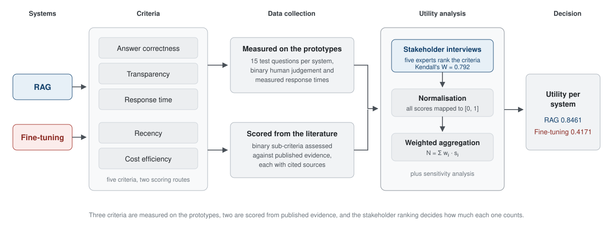
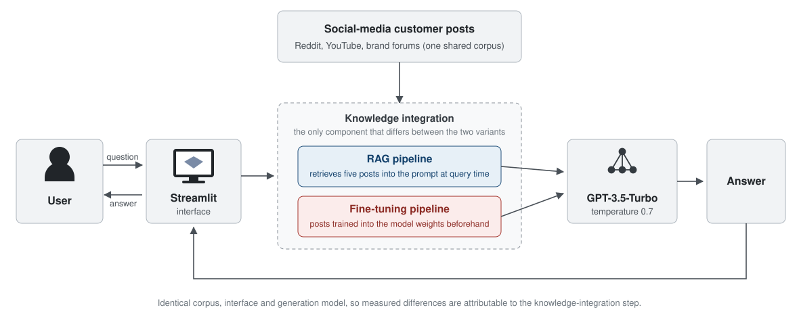
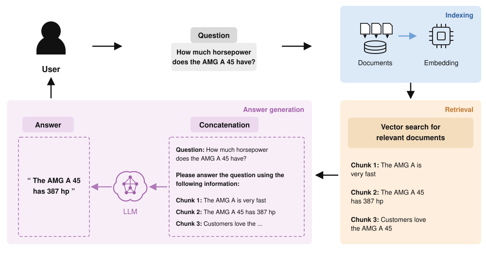
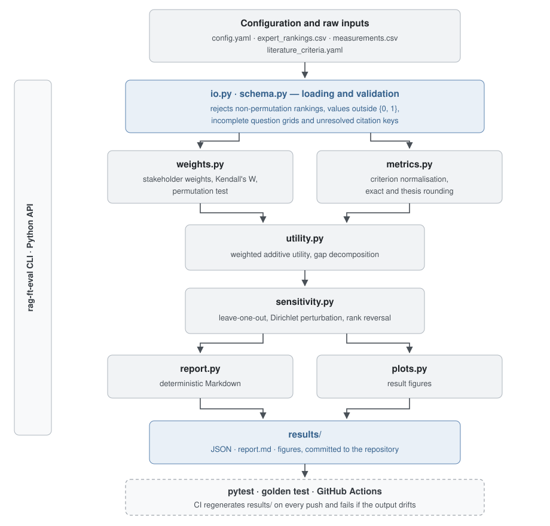
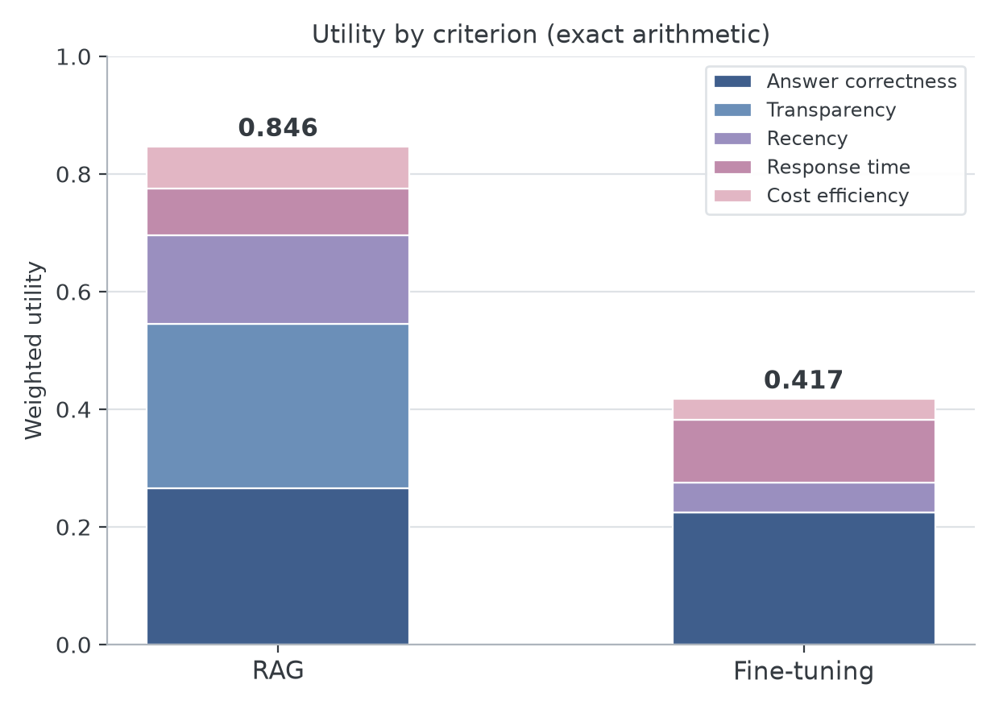
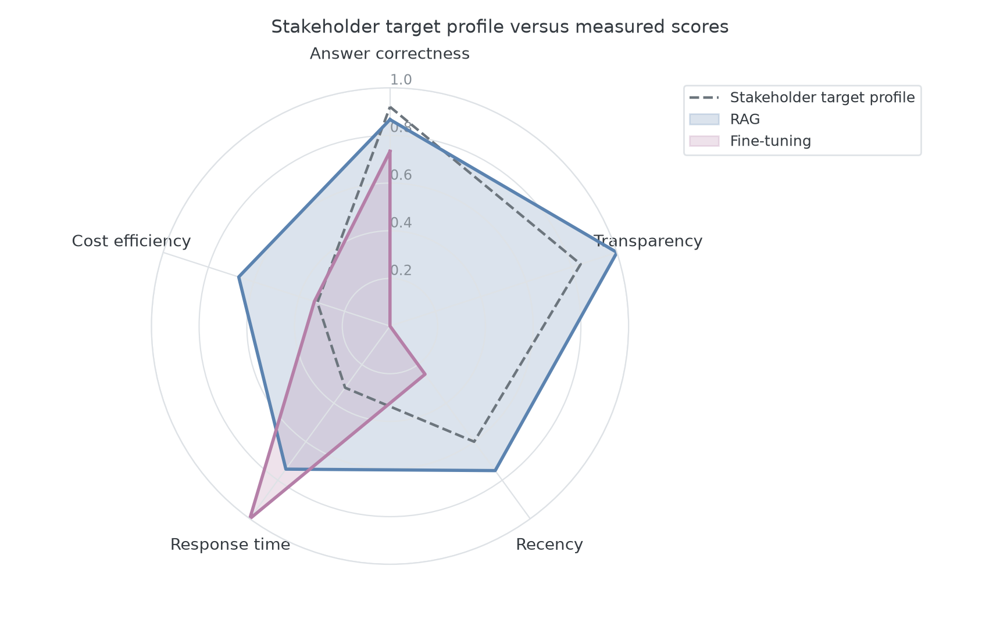
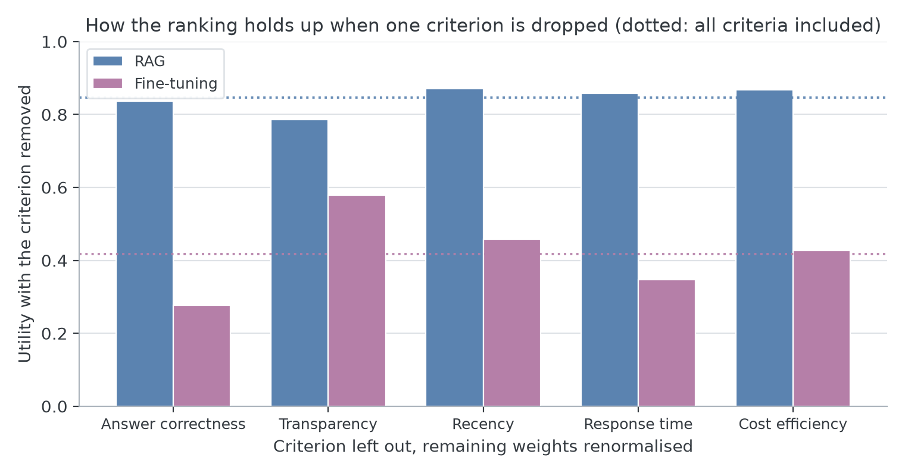

# RAG vs. Fine-Tuning Evaluation

**A reproducible stakeholder-weighted evaluation pipeline for comparing domain-adaptation
strategies, applied to retrieval-augmented generation and supervised fine-tuning**

> Research Project @ **Mercedes-AMG**, Market Intelligence<br>
> by **Cecilia Nothstein**, July 2025<br>

A department that wants a question-answering assistant over its customer feedback has to pick a
domain-adaptation strategy, and accuracy alone does not decide it. Whether an analyst can see where
an answer came from, how quickly last week's feedback reaches the system, how long a query takes
and what the setup costs over its lifetime all matter, and they trade off against each other. The
literature reviewed for this project emphasised technical performance; the organisational trade-off
was less systematically operationalised.

> **RQ** Which of the two strategies for domain specialisation of large language models,
> retrieval-augmented generation or supervised fine-tuning, achieves the higher economic value in
> the context of analysing social-media customer data?

Two matched prototypes were built on the same corpus and evaluated on the same 15 questions across
five criteria weighted by the practitioners who would use the system. **RAG reached a utility of
0.8461 against 0.4171 for fine-tuning under the elicited stakeholder profile.** Two thirds of that
gap come from a single criterion, transparency, where the difference is architectural rather than a
matter of answer quality: the fine-tuning prototype had no retrieval layer and therefore could show
no per-answer sources. The pipeline also quantifies how far priorities would have to move before
the ranking flips, namely response time rising from a weight of 0.11 to 0.66. The result holds for
this application context, these operationalised criteria and this stakeholder profile, and the
repository is built so that any of them can be changed and the analysis rerun.

---

## Study design



| Criterion | Definition | Scoring |
|---|---|---|
| Answer correctness | Share of answers that are factually and contextually right | 15 test questions, binary human judgement |
| Transparency | Whether the origin of an answer can be traced by the user | 15 test questions, binary judgement: were supporting sources shown |
| Recency | How quickly new or changed information reaches the answers | 4 binary sub-criteria from published evidence |
| Response time | Seconds from question to complete answer | Measured per question; fastest mean divided by system mean |
| Cost efficiency | Initial, inference and scaling cost over the lifecycle | 3 binary sub-criteria from published evidence |

Recency and cost efficiency depend on deployment scale and update frequency, which a 15-question
prototype study cannot represent. They are scored against the literature on binary sub-criteria
that each carry their sources in
[`literature_criteria.yaml`](data/case_study/literature_criteria.yaml), and marked as
literature-scored wherever they appear.



Both prototypes shared the corpus, the interface, the generation model (GPT-3.5-Turbo, temperature
0.7) and the question set, so measured differences are attributable to the knowledge-integration
step. The RAG variant embedded the posts with `all-MiniLM-L6-v2`, retrieved the five most similar
ones from a Pinecone index and displayed them next to the answer. The fine-tuning variant trained a
GPT-3.5-Turbo instance on question-answer pairs from the same posts and answered without
retrieval.

### The RAG variant at query time



Indexing runs once. At query time the question is embedded into the same vector space, the five
nearest posts are retrieved and concatenated with the question into the prompt, and the model
answers from that prompt. Those five posts are also displayed next to the answer, which is exactly
what the transparency criterion measures and what the fine-tuning variant has no equivalent of.

### Criterion weights

Five practitioners with at least three years in portfolio and market strategy ranked the criteria
by forced ranking, which avoids the "everything is important" pattern of rating scales. Questions,
answers, response times and judgements are committed verbatim in
[`measurements.csv`](data/case_study/measurements.csv), so any individual judgement can be disputed
and the analysis rerun.

| Criterion | Mean rank | SD | Weight |
|---|---|---|---|
| Answer correctness | 4.60 | 0.55 | 0.3067 |
| Transparency | 4.20 | 0.84 | 0.2800 |
| Recency | 3.00 | 0.71 | 0.2000 |
| Response time | 1.60 | 0.55 | 0.1067 |
| Cost efficiency | 1.60 | 0.89 | 0.1067 |

Rater agreement: **Kendall's W = 0.792**, chi-square p = 0.0032, and p = 0.0001 under a
permutation test over 20,000 resamples, which is reported because the chi-square approximation is
coarse at five raters.

---

## Implementation

The original study evaluated two matched QA prototypes. **This repository publishes the evaluation
pipeline and the research inputs used to analyse their outputs**, not the prototype source code
itself; their configuration is documented in [`docs/system-design.md`](docs/system-design.md).

`rag_ft_eval` is a reusable Python package that turns raw evaluation inputs into a decision and
into a report that can be regenerated from scratch at any time.



Each stage is a separate module with a typed result object, so the pipeline can be driven end to
end by the CLI or assembled piecewise from Python:

| Module | Responsibility |
|---|---|
| `io.py`, `schema.py` | YAML-configured input loading; validation of ranking permutations, `{0, 1}` domains, question-grid completeness and citation-key resolution; frozen dataclasses for every result |
| `weights.py` | Stakeholder weights from forced rankings; Kendall's W with the chi-square approximation and a seeded Monte-Carlo permutation test |
| `metrics.py` | Criterion normalisation for binary judgements, ratio-to-best latency and literature-scored sub-criteria; two rounding modes |
| `utility.py` | Weighted additive utility and decomposition of the gap between the top two systems |
| `sensitivity.py` | Leave-one-criterion-out, Dirichlet weight perturbation and closed-form rank-reversal thresholds |
| `report.py`, `plots.py` | Deterministic Markdown report with rendered citations, and result figures |
| `cli.py` | `rag-ft-eval run \| weights \| sensitivity \| validate` |

Reproducibility is enforced rather than asserted. The committed `results/` directory is the output
of the code, a golden test compares a fresh run against it field by field, and the CI workflow
regenerates both rounding modes on every push and fails if anything drifts. That means no number in
this README can silently diverge from the code that produced it.

| Layer | Technology |
|---|---|
| Language | Python 3.11+, `src/` layout |
| Data | pandas, NumPy, PyYAML |
| Statistics | SciPy |
| Visualisation | Matplotlib |
| Packaging | pyproject.toml, Hatchling, uv |
| CLI | `rag-ft-eval` |
| Testing | pytest, 46 offline tests including a golden test |
| Quality | Ruff, pre-commit, Gitleaks |
| CI | GitHub Actions on Python 3.11 and 3.12, with result regeneration |

Used as a library:

```python
from rag_ft_eval import load_config, run_evaluation

run = run_evaluation(load_config("data/case_study/config.yaml"))
print(run.utility.winner, round(run.utility.total_of("rag"), 4))  # rag 0.8461
print(run.weights.kendall.w, round(run.weights.kendall.p_perm, 4))  # 0.792 0.0001

for row in run.sensitivity.leave_one_out:
    print(row.dropped_metric, round(row.delta, 4), row.winner)
```

---

## Results

| Criterion | Weight | RAG | Fine-tuning |
|---|---|---|---|
| Answer correctness | 0.3067 | 0.867 (13/15) | 0.733 (11/15) |
| Transparency | 0.2800 | 1.000 (15/15) | 0.000 (0/15) |
| Recency | 0.2000 | 0.750 (3/4) | 0.250 (1/4) |
| Response time | 0.1067 | 0.742 (mean 3.96 s) | 1.000 (mean 2.94 s) |
| Cost efficiency | 0.1067 | 0.667 (2/3) | 0.333 (1/3) |
| **Weighted utility** | | **0.8461** | **0.4171** |



Fine-tuning answers faster, 2.94 s against 3.96 s, because there is no retrieval step, and it is
cheaper per request. It loses on the criteria the stakeholders ranked higher. The gap of 0.4290
decomposes as:

| Criterion | Contribution to gap | Share |
|---|---|---|
| Transparency | 0.2800 | 65.3 % |
| Recency | 0.1000 | 23.3 % |
| Answer correctness | 0.0409 | 9.5 % |
| Cost efficiency | 0.0356 | 8.3 % |
| Response time | -0.0275 | -6.4 % |

The largest term is not a quality difference. The fine-tuning prototype scored 0 on transparency
because it had no retrieval layer to expose, so the criterion the stakeholders ranked second was
settled by an architectural choice. That makes the robustness analysis the more important half of
the evaluation.



The same result seen as a profile: the dashed line is what the stakeholders asked for, scaled to
the same range as the scores. RAG covers it on every criterion except response time. Fine-tuning
exceeds it on response time alone and falls short everywhere else, most visibly on transparency.

## Robustness



- **Leave one criterion out.** RAG stays ahead in all five cases. The smallest remaining gap is
  0.2069, when transparency is removed and the other weights are rescaled proportionally.
- **Perturb the weights.** Over 10,000 weight vectors drawn from a Dirichlet distribution centred
  on the elicited weights, RAG wins 100 % of the time; its advantage never falls below 0.2022
  (5th percentile 0.3321, mean 0.4289).
- **Rank reversal.** Response time is the only criterion whose weight can flip the ranking, and it
  would have to rise from 0.1067 to **0.6648**. No change to any other single weight reverses the
  result.

Within this utility model, fine-tuning therefore overtakes RAG only for a stakeholder profile that
weights response time at roughly two thirds of the total, far outside the range the interviews
produced. The analysis tests robustness to the weight model; the study's other methodological
constraints are documented in [`docs/limitations.md`](docs/limitations.md).

---

## Reproducing

Every table and figure above is generated from the committed inputs, and CI regenerates them on
Python 3.11 and 3.12.

```bash
uv sync --extra plots
uv run rag-ft-eval run data/case_study/config.yaml                     # exact arithmetic -> results/
uv run rag-ft-eval run data/case_study/config.yaml --rounding thesis --output results/thesis_rounding
uv run pytest                                                           # 46 offline tests, no API keys
```

Without `uv`:

```bash
python -m venv venv && source venv/bin/activate
pip install -r requirements.txt -e .
rag-ft-eval run data/case_study/config.yaml
```

`rag-ft-eval weights CONFIG` prints the weights and agreement statistics, `rag-ft-eval sensitivity
CONFIG` the robustness tables, and `rag-ft-eval validate CONFIG` checks a configuration and its
inputs without computing anything.

The thesis reported 0.8453 and 0.4167 because intermediate values were rounded before aggregation;
`--rounding thesis` reproduces that convention exactly. Ranking and interpretation are the same in
both modes, and the details are in [`docs/provenance.md`](docs/provenance.md).

### Applying it to another comparison

The package is not specific to this case study. Point a configuration at your own inputs;
[`config.yaml`](data/case_study/config.yaml) documents the schema. Expert rankings are a long table
of `expert_id, metric, rank`; measurements hold one row per question and system; literature criteria
are binary sub-criteria with citation keys. The loader rejects non-permutation rankings, values
outside `{0, 1}`, incomplete question grids and unresolved citation keys with a precise message.

## Repository layout

```
src/rag_ft_eval/
  weights.py       expert rankings -> weights; Kendall's W with chi-square and permutation test
  metrics.py       binary, ratio-to-best and literature scores; exact / thesis rounding
  utility.py       weighted additive utility and gap decomposition
  sensitivity.py   leave-one-out, Dirichlet perturbation, rank-reversal thresholds
  io.py            configuration and input loading with validation
  schema.py        typed result objects
  evaluate.py      end-to-end run and output writing
  report.py        deterministic Markdown report
  plots.py         result figures
  cli.py           rag-ft-eval run | weights | sensitivity | validate
data/case_study/   the raw research inputs: rankings, questions, measurements, literature criteria
results/           committed output, exact arithmetic; results/thesis_rounding/ for the thesis convention
tests/             46 offline tests, including the golden test that pins results/ to the code
docs/
  methodology.md   every formula the package computes, with references
  system-design.md configuration of the two prototypes and what was measured how
  limitations.md   what this study can and cannot support
  provenance.md    what came from the thesis, what this repository added, and the rounding modes
  figures/         English diagrams used in the documentation
  thesis_figures/  the original German thesis figures, kept for provenance
```

## Contact

If you work on LLM evaluation, human-AI interaction, or decision support for AI system selection,
I am happy to discuss the method, the study design or the implementation. 🌟

Cecilia Nothstein, <Cecilia.Nothstein@gmail.com>
