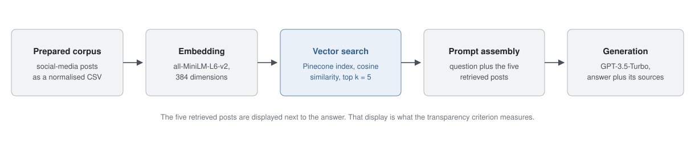

# System design of the two prototypes

The prototypes were built to make the comparison fair rather than to be production systems. They
share the corpus, the interface, the generation model and the decoding parameters. The only
component that differs is how domain knowledge reaches the model.

The prototypes themselves were Streamlit applications over a corpus that is not released, so
they are not part of this repository. Their retrieval, generation and fine-tuning behaviour is
reconstructed as library code in `src/rag_ft_eval/pipelines/`, and this document records the
configuration behind it, so that the measurements in
[`../data/case_study/measurements.csv`](../data/case_study/measurements.csv) can be read with the
right context.

Screenshots of the finished interface are in the README. The figures in them are placeholders, replaced for data-protection reasons.

## Shared components

| Component | Configuration |
|---|---|
| Generation model | GPT-3.5-Turbo through the OpenAI chat-completion API |
| Decoding | temperature 0.7 |
| Interface | Streamlit web application, one page per variant plus a side-by-side comparison page |
| Corpus | 4,000 rows of social-media-style posts about Mercedes-Benz and AMG vehicles, German and English, normalised to a single CSV schema |
| Test protocol | the same 15 questions, asked of both variants, with wall-clock time taken per answer |

GPT-3.5-Turbo was chosen because it was the model both strategies could share: fine-tuning was
available for it through the provider API, and the same base model could serve the RAG variant
unchanged. That keeps the comparison about knowledge integration rather than about model capacity.

## RAG variant

| Step | Configuration |
|---|---|
| Embedding model | `sentence-transformers/all-MiniLM-L6-v2`, 384 dimensions |
| Vector store | Pinecone serverless index, cosine similarity |
| Retrieval | top k = 5, with a metadata filter on the detected query language |
| Prompt assembly | the five retrieved posts are concatenated after the question |
| Output | the answer plus the five retrieved posts, displayed next to it |

The last row is what the transparency criterion measures. The retrieved posts are shown to the
user, so the origin of an answer can be checked against them.

At query time the three phases run as follows: the corpus is embedded once into the index, the
question is embedded and matched against it, and the retrieved chunks are concatenated with the
question into the prompt that the model answers from.

## Fine-tuning variant

| Step | Configuration |
|---|---|
| Method | supervised fine-tuning through the OpenAI fine-tuning API |
| Base model | `gpt-3.5-turbo` |
| Training format | chat-completion JSONL with a system, user and assistant message per example |
| Training data | question-answer pairs derived from the same corpus |
| Hyper-parameters | provider defaults; none were tuned |
| Inference | the question goes directly to the resulting fine-tuned model instance |

No retrieval step exists in this variant, so no per-answer sources can be displayed. This is a
property of how the prototype was built, not a general property of fine-tuned systems: a
provenance mechanism could be added, for instance by attaching a retrieval layer or by training
the model to emit citations. It was not part of the evaluated artifact, and the transparency
score reflects the artifact that was measured.

## What was measured, and how

| Criterion | Instrument |
|---|---|
| Answer correctness | each of the 15 answers judged 1 if it addresses the question, contains no factually wrong or self-contradictory statement, and 0 otherwise |
| Transparency | 1 if the answer came with traceable supporting material, 0 otherwise |
| Response time | wall clock from submitting the question to the complete answer, one observation per question and system |
| Recency, cost efficiency | not measured on the prototypes; scored from published evidence on binary sub-criteria, see [`../data/case_study/literature_criteria.yaml`](../data/case_study/literature_criteria.yaml) |

Correctness and transparency were judged by one annotator against a written rule set, so no
inter-annotator agreement is available. The judgements and the answers they refer to are
committed verbatim, which lets a reader disagree with any individual call and recompute the
result.

## Corpus

The corpus consisted of social-media-style posts about Mercedes-Benz and AMG vehicles. It was
largely template-generated, with a small share of authentic public posts, and it is not part of
this release. Correctness was therefore judged against the content of that corpus rather than
against ground truth about the real market, which is one of the limits recorded in
[`limitations.md`](limitations.md). No proprietary company data was used at any point.
